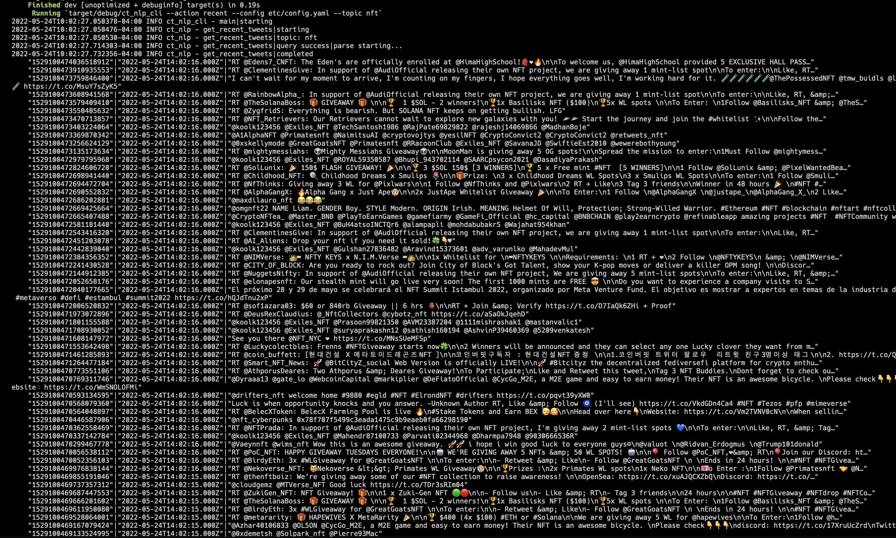
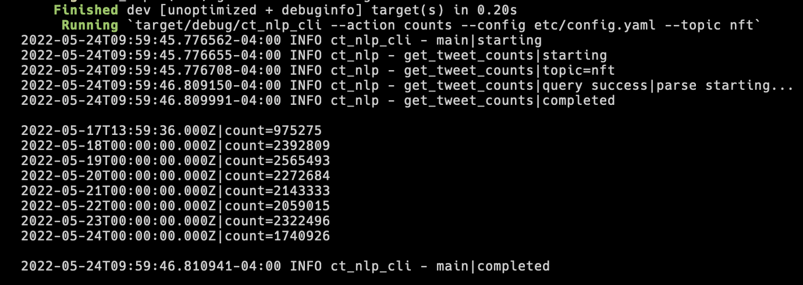
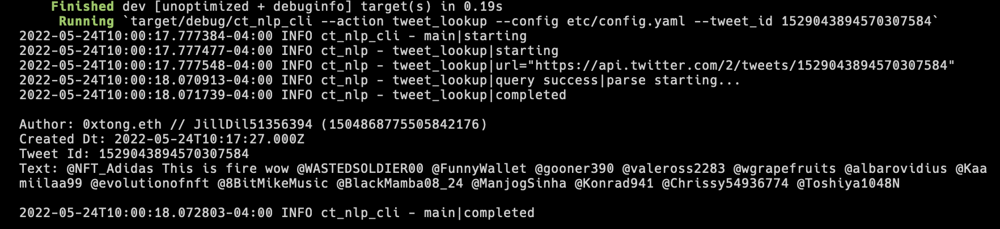
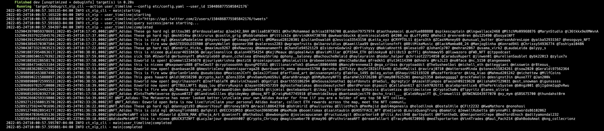

# data-extractor-rs

## DESIGN

Event-Driven Data Warehouse Creation for NLP and on-chain analytics, with a focus on NFT data.   
A 'flow' is an ETL pipeline sequence that generates an output, in the form of either transformed data or analysis.  
A 'flow_step' signifies an operation on set of data. (copy, move, transform, ...)  
The modular design allows for scalable, custom ETL pipeline creation by chaining together relevant processes.  

     

## CLI

The CLI tool is designed to query specific subjects of interest prior to setting up a pipeline.  
The current set of supported actions hit the twitter v2 api endpoint.  

### Recent Command

     

### Counts Command

     

### Tweet Lookup Command

     

### User Timeline Command

     

## NLP Strategy

 Current NFT Sentiment Analysis Design:  
- Perform standard sentiment analysis on tweet text for a particular topic.  
- R&D to include tweet impressions in analysis (likes + retweets + comments)  
- Aggregate Persons of Interest as separate topics and include them for the analysis. (EX. Do Kwon for topic = "LUNA")  
  - Avoid shitposters, anime pfps, and trolls  
- Aggregate Projects of Interest as separate topics and include them for the analysis. (EX: Cyberkongz,Nansen.ai,LooksRare for topic = "NFT")  

