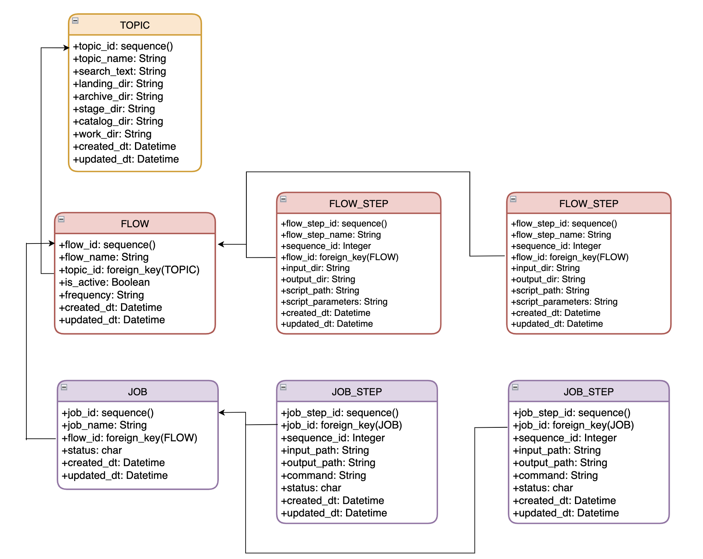

# honey-faucet-rs

## DESIGN

Event-Driven Data Warehouse Creation for NLP and on-chain analytics, with a focus on NFT data.   
A 'flow' is an ETL pipeline sequence that generates an output, in the form of either transformed data or analysis.  
A 'flow_step' signifies an operation on set of data. (copy, move, transform, ...)  
The modular design provides a framework for building scalable, custom ETL pipelines.  

     

## CLI

The CLI tool is designed to query specific subjects of interest prior to setting up a pipeline.  
The current set of supported actions hit the twitter v2 api endpoint.   

Suggested Use (Topic Search):  
- The [Counts] command should be used to gauge how much data there is for a particular topic.  
- The [Recent] command should be used to view the first 100 results of raw tweet data for a particular topic.  
- At this point, if enough data is available for a particular topic, a flow can be set up for it.  
- Otherwise, one can do a deep dive using the [Tweet Lookup], [User Timeline], [Mentions Timeline], or [Users Lookup] commands.   

Suggested Use (Account R&D - Persons/Projects of Interest):  
- If the unique user name is known, then the user_id can be found using the [Users Lookup] command.  
- Next, the [User Timeline] or [Mentions Timeline] commands can be used to view a portion of the timeline data for a particular user.  

### Recent Command

     

### Counts Command

     

### Tweet Lookup Command

     

### User Timeline Command

     

### Users Lookup Command

     

## SUPPORTED FEATURES

nlp-recent-topic-land - This flow step will pull and land recents data for a topic. 
nlp-user-timeline-land - This flow step will pull and land standard timeline data for a particular user.  
nlp-topic-land - This flow step will pull and land data specified by date for a topic. (WIP - R&D for v1.1 endpoint for archive search)  
flow-controller - This mechanism will facilitate the booting and stopping of jobs based on configured schedules. (v1)  
job-controller - This mechanism will facilitate the booting and stopping of job steps. (v1 - supports single step flows)  

## NOTES
*design is subject to change as implementation progresses.  
methodology is agile and re-factoring takes place after each feature is finished.  

### NLP Strategy

Current NFT Sentiment Analysis Design:  
- Collect data for an initial Training and Test Set.  
- Perform standard sentiment analysis on tweet text for a particular topic.  
- R&D to include tweet impressions in analysis (likes + retweets + comments)  
- Aggregate Persons of Interest as separate topics and include them for the analysis. (EX. Do Kwon for topic = "LUNA")  
---- Avoid shitposters, anime pfps, and trolls  
- Aggregate Projects of Interest as separate topics and include them for the analysis. (EX: Cyberkongz,Nansen.ai,LooksRare for topic = "NFT")  
- R&D on analysis tuning

### NLP PIPELINE DESIGN

The current design will consist of a 4-step Flow.  
- The first step will be called nlp-topic-land.  
---- This step will pull data down from Twitter and save it in a parquet file format.  
- The second step will handle the transformation of the data to remove duplicate tweets. (Not sure if this step is needed) 
- The third step will pre-process the text data.  
- The fourth step will make classifications on a data set based on various algorithms. (Naive Bayes, SVM, Logistic Regression, LSTM, etc...)  
- The idea is to be able to provide sentiment classification (positive / negative) for a particular topic for a particular interval (Past 24HR, Past 7D, Past 30D).  
 

